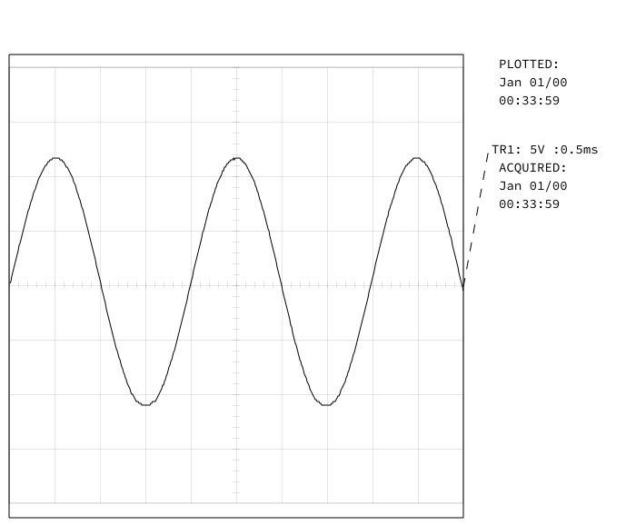
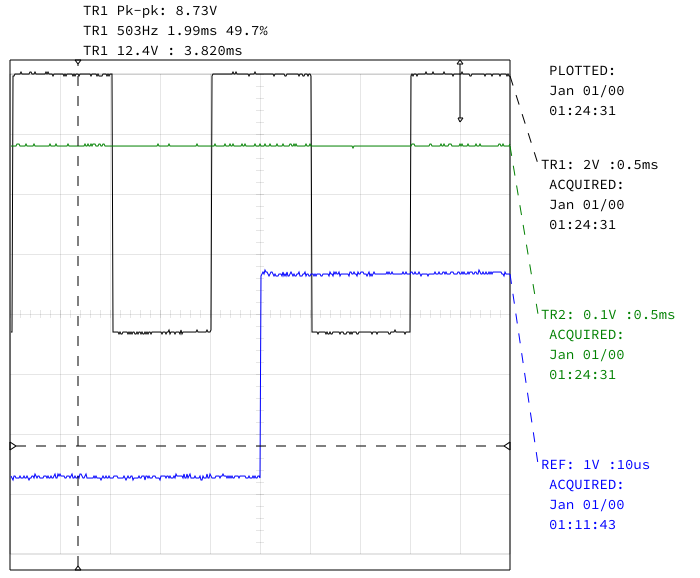
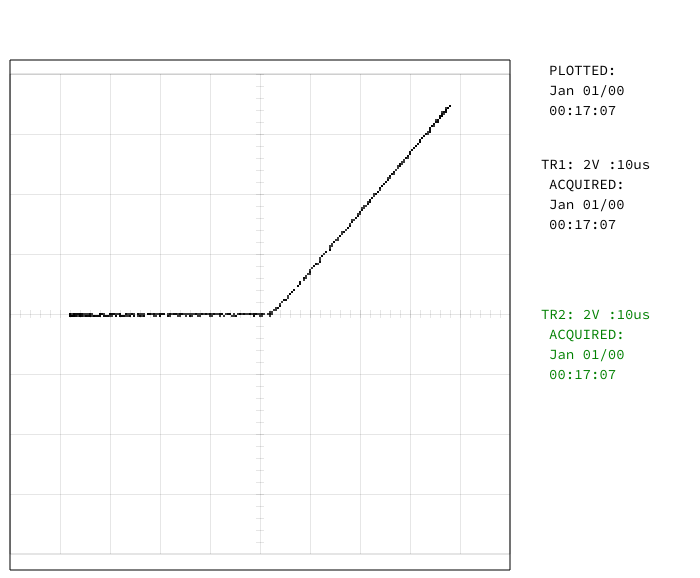

# USB Interface for Gould 475 Oscilloscope

PCB and software to interface a Gould 475 oscilloscope with a PC over USB.

The STM32 software interprets the HPGL that is output from the oscilloscope and
converts it to SVG format. The SVG data is transmitted to dsoctl over USB.

